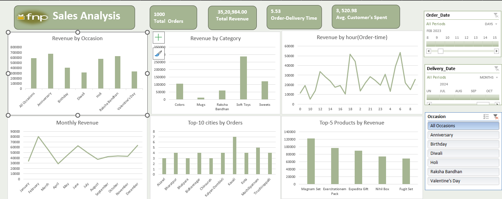
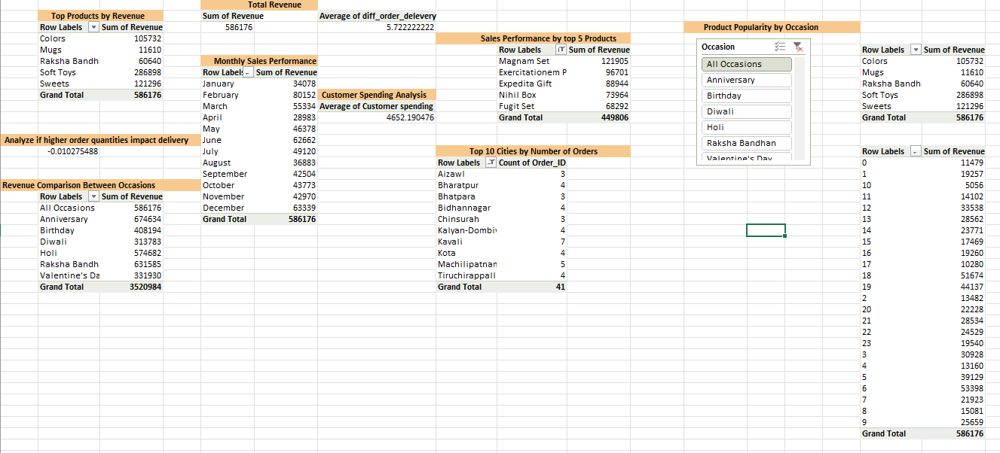

## 🎁 Ferns & Petals (FNP) Sales Analysis (Excel Dashboard)

An end-to-end sales analytics project built entirely in Excel: from raw multi-table data to a fully interactive dashboard for Ferns and Petals (FNP), a gifting company that sells occasion-based products (Anniversary, Birthday, Diwali, Holi, Raksha Bandhan, Valentine's Day).

The project simulates a real analytics workflow: 
**Extract → Transform → Model (Star Schema) → Analyze (DAX/PivotTables) → Visualize (Dashboard).**

---
## 📌 Business Problem

FNP wanted to understand its sales performance and customer behavior to sharpen its sales strategy and improve customer satisfaction. The analysis had to answer:

-  What is the overall revenue?
- What is the average order-to-delivery time?
- How does monthly sales performance fluctuate across 2023?
- Which products are the top revenue generators?
- How much are customers spending on average?
- How do the top 5 products perform in terms of sales?
- Which 10 cities place the highest number of orders?
- Does a higher order quantity impact delivery time?
- How does revenue compare across occasions?
- Which products are most popular for specific occasions?

## 🗂️ Data Collection

The raw data came as three related tables:

**Table	Description**

 **Orders:**	Order ID, order date, delivery date, quantity, occasion, city (fact table)

 **Products:**	Product ID, product name, category, price, Occasion

 **Customers:**	Customer ID, customer details

**Price** was not directly available in the Orders table, so it had to be pulled in from the Products table before revenue could be calculated.

## 🛠️ Tools & Techniques Used

- Excel — end-to-end workbook
- Power Query — data extraction & transformation
- Data Model (Power Pivot) — relational star schema
- DAX — calculated columns
- PivotTables & PivotCharts — analysis
- Slicers — interactive filtering (by Occasion, Order Date, Delivery Date)

## 🔧 Methodology
**Step 1 - Extraction & Transformation (Power Query)**
- Imported the Orders, Products, and Customers tables into Power Query.
- Merged the Products table into Orders to bring in Price (since Orders only had Quantity).
- Added new columns to the Orders table:
  - Order_Time — time component extracted from the order timestamp
  - Diff_Order_Delivery — number of days between order date and delivery date
  - Order_Month — month extracted from the order date
- Loaded the cleaned tables into the Excel Data Model.

**Step 2 - Data Modeling (Star Schema)**

- Built a star schema in the Data Model:
  - Fact table: Orders (transaction-level data)
  - Dimension tables: Products, Customers

This structure keeps the model normalized and makes the PivotTables fast and easy to slice by product or customer attributes.

**Step 3 - DAX Calculated Columns**
- Added two key calculated columns directly in the Data Model:
  - Revenue = Price * Quantity
  - Order_Day_Name = FORMAT(Order_Date, "DDDD")

**Step 4 - Analysis (PivotTables)**

- Used **PivotTables/PivotCharts** built on the Data Model to answer each of the business questions, with Occasion, Order_Date, and Delivery_Date slicers for interactive filtering.

**Step 5 - Dashboard Design**

- Consolidated all the visuals into a single interactive Excel dashboard with **KPI cards, bar charts, a line/trend chart, and slicers.**

## 📊 Dashboard Preview
*Main Dashboard*

*Pivot Table Analysis*

## 🔑 Key Insights
- 📦 1,000 total orders generated ₹35,20,984 in total revenue, at an average customer spend of ₹3,520.98.
- 🚚 The average order-to-delivery time is 5.53 days, and orders take slightly longer for the Anniversary and Raksha Bandhan periods.
- 📈 Anniversary (₹6,74,634) and Raksha Bandhan (₹6,31,585) are the top revenue-generating occasions, while Diwali (₹3,13,783) and Valentine's Day (₹3,31,930) generate the least — a notable gap given how prominent Diwali and Valentine's Day usually are for gifting.
- 🧸 Soft Toys and Sweets are the strongest-performing product categories by revenue, far ahead of Mugs.
- The top 5 individual products (Magnam Set, Exercitationem Pack, Expedita Gift, Nihil Box, Fugit Set) together contribute roughly 13% of total revenue, with the Magnam Set alone bringing in ₹1,21,905.
- 🗓️ Monthly revenue is highly seasonal-spikes in February and December (gifting seasons) with a clear dip in April and August.
- Orders are spread thin across cities rather than concentrated in a few - the top 10 cities (e.g., Kavali, Machilipatnam, Tiruchirapalli) each contribute only a handful of orders, signaling a long-tail, pan-India customer base rather than a few dominant metros.
- 🔗 The correlation between order quantity and delivery time is effectively zero (≈ -0.01) - larger orders are not causing delivery delays, so delivery time is likely driven by logistics/location rather than order size.

## 💡 Recommendations
- Boost Diwali & Valentine's Day campaigns: these occasions currently underperform relative to their market potential- targeted promotions, bundled offers, or earlier marketing pushes could close the gap.
- Double down on Soft Toys and Sweets: expand catalog depth and cross-sell these categories during high-performing occasions like Anniversary and Raksha Bandhan.
- Investigate the April/August revenue dip: plan mid-year promotional campaigns or festive-style offers to smooth out the seasonal trough.
- Expand reach in emerging cities: since order volume is thinly spread across many tier-2/3 cities, localized delivery partnerships or regional marketing could convert this long tail into more concentrated demand.
- Delivery time is not quantity-driven: since bulk orders don't slow delivery, FNP can safely promote bundle/bulk purchases without adding delivery-time risk; any delivery delays should instead be investigated by city/logistics partner.
- Promote top 5 products more visibly (homepage, ads) since they already show strong individual pull: pairing them with underperforming occasions (e.g., feature the Magnam Set in Diwali campaigns) could lift both.

## Skills demonstrated: 
  Data Cleaning · Data Modeling (Star Schema) · DAX · PivotTables/PivotCharts · Dashboard Design · Business Insight Generation
## 🚀 How to Use
- Download FNP_Sales_Analysis_Dashboard.xlsx.
- Open in Excel (with Power Query / Power Pivot enabled).
- Go to the Dashboard sheet and use the Occasion, Order Date, and Delivery Date slicers to explore the data interactively.
- Check the PivotTables sheet to see the underlying calculations for each business question.
